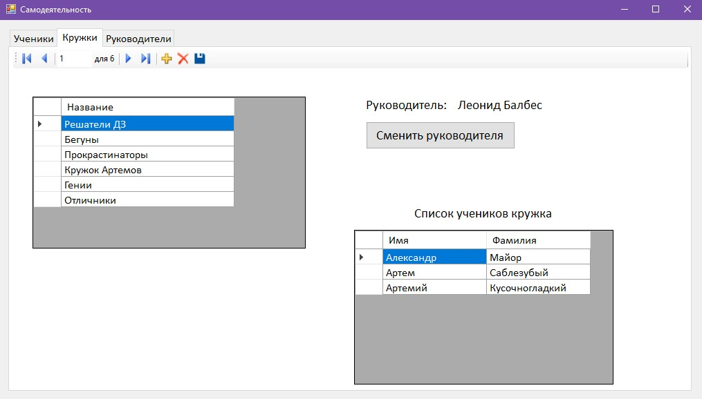

<h1 align="center"> Студенческие кружки </h1>

## Постановка задачи

Самодеятельность со списком кружков (руководитель, список учеников кружка), списком учеников (список кружков ученика), списком руководителей (список кружков руководителя, список учеников руководителя). Состояния ученика:
1) желание – определение списка кружков; 
2) поступление – включение в списки кружков; 
3) уход – исключение из кружка

----
<h2 align="center"> Описание интерфейса </h1>

Оконное приложение состоит из главного окна, которое представляет собой область с тремя вкладками – “Ученики”, “Кружки”, “Руководители”. Каждая вкладка реализует показ соответствующих списков из исходной постановки задачи с возможностью редактировать все основные списки (добавлять, удалять, редактировать записи) и с некоторым дополнительным функционалом. После ручного редактирования (вышеперечисленные операции) данных в основной таблице соответствующей вкладки следует нажать кнопку “Сохранить”.

### Вкладка "Ученики"

На первой вкладке основная таблица представляет список учеников, переключаясь между которыми автоматически заполняется таблица посещаемых студентом кружков и становятся активными/неактивными кнопки покидания кружков и записи на кружки. 
Как было сказано ранее, основную таблицу можно редактировать, но необходимо придерживаться следующих правил (нарушить их система не даст):
- все ячейки имени и фамилии должны быть не пусты
- нельзя удалить ученика, который руководит хотя бы одним кружком (кнопка удаления станет неактивной при выборе такового)

Чтобы взаимодействовать с кнопкой “Покинуть”, пользователь должен быть записан на хотя бы 1 кружок и необходимо выбрать СТРОКИ кружков, которые хотим покинуть (в DataGridView для этого нужно нажать на любую строку самой левой пустой колонки таблицы и потянуть, удерживая ЛКМ / либо с нажатой клавишей Ctrl выбрать желаемые строки в этой колонке). Выбрав кружки, нажимаем “Покинуть”, после чего появится всплывающее окно с вопросом, уверены ли мы, что хотим покинуть выбранные кружки. Нажимаем “Да” и изменения сразу сохраняются в базу / нажимаем “Нет” и ничего не происходит.

Чтобы взаимодействовать с кнопкой “Записаться на кружки”, ученик должен находиться в базе данных (если выбранный ученик не сохранен, об этом подскажет метка с текстом красного цвета). Нажимаем “Записаться на кружки” и открывается форма выбора кружков для записи (в которых выбранный ученик не состоит и которыми он не руководит).

Здесь мы можем отфильтровать доступные выбранному ученику кружки по названию, после чего необходимо выбрать СТРОКИ кружков, на которые хотим записаться и нажимаем “Записаться”. Изменения сразу сохраняются в базу, вспомогательное окно формы закроется. Если закроем данную форму нажатием на крестик, то ничего не произойдёт.

### Вкладка "Кружки"

На второй вкладке основная таблица представляет список кружков, переключаясь между которыми автоматически заполняется таблица учеников данного кружка и становится активной/неактивной кнопка смены руководителя текущего кружка.

Как было сказано ранее, основную таблицу можно редактировать, но необходимо придерживаться следующих правил (нарушить их система не даст):
- все ячейки названий кружков должны быть не пусты
- все названия кружков должны быть уникальны

При создании нового кружка (кнопка “Add” в навигаторе сверху) сразу же открывается форма добавления кружка. На ней нужно выбрать руководителя создаваемого кружка, (будут выведены все текущие ученики, сохранённые в базе), а также придумать уникальное название кружка.

Можно отфильтровать учеников по фамилии. Для выбора кандидата достаточно нажать на любую ячейку. Когда руководитель и название выбраны, нажимаем на кнопку “ Создать”, после чего произойдёт одно из двух: если кружок с таким названием уже существует в базе, то появится предупреждающая метка с текстом красного цвета; иначе вспомогательное окно с формой закрывается, и можно сохранить добавленный кружок в базе. Если мы закрыли форму добавления по крестику, то создание нового кружка отменится.

Чтобы взаимодействовать с кнопкой “Сменить руководителя”, кружок должен находиться в базе данных (если выбранный кружок не сохранен, об этом подскажет метка с текстом красного цвета), а также данный кружок должен посещать хотя бы один ученик, так как новый руководитель может выбираться только среди учеников данного кружка. Нажимаем “Сменить руководителя” и открывается форма выбора нового руководителя кружка. 

Можно отфильтровать учеников по фамилии. При выборе кандидата (можно нажать на любую ячейку), жмём “Выбрать”, после чего вспомогательное окно с формой закрывается, изменения сразу сохраняются в базу, а также при этом сохраняются все несохраненные действия по редактированию основной таблицы второй вкладки (таблица кружков). Если мы закрыли форму смены руководителя по крестику, то ничего не произойдёт (действие по смене руководителя данного кружка отменится).

### Вкладка "Руководители"

На третьей вкладке основная таблица представляет список учеников, переключаясь между которыми автоматически заполняется таблица руководимых студентом кружков и таблица со списком учеников данного студента. Основная таблица этой вкладки (руководители) тесно связана с основной таблицей первой вкладки, в частности текущий ученик общий для обеих вкладок, а также общие кнопки добавления, удаления и сохранения.

При редактировании таблицы “руководители” нужно придерживаться тех же правил, что и в таблице “ученики” (нарушить их система не даст):
- все ячейки имени и фамилии должны быть не пусты
- нельзя удалить ученика, который руководит хотя бы одним кружком (кнопка удаления станет неактивной при выборе такового)
